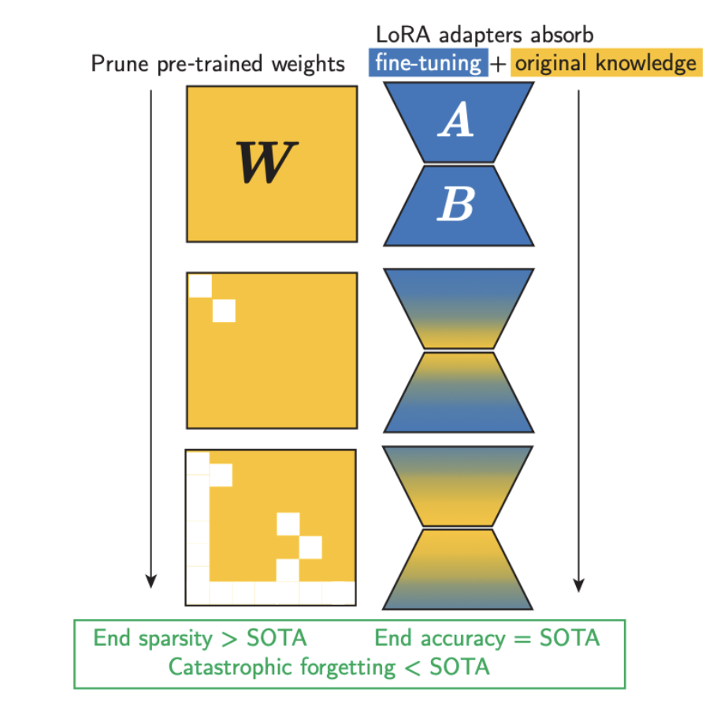

# Prune As You Tune: LoRA-Enabled Model Compression

This repository contains the codebase for the paper "Prune As You Tune: LoRA-Enabled Model Compression," our CS2420 Final Project.

<div align="center">
  
</div>

Graphical overview of our method. Prune As You Tune (PAYT) interleaves pruning of pre-trained parameters with LoRA fine-tuning updates guided by a custom Knowledge Distillation loss function. PAYT can achieve up to 50% sparsity with minimal accuracy degradation and lower perplexity on the original task compared to baselines such as full fine-tuning and prune-then-fine-tune methods. Compared to state-of-the-art approaches, PAYT offers superior accuracy, model compression, and retention of pre-training knowledge.


`src` contains the Prune As You Tune implementation.  
`dev` contains initial experimentation and tests.  
`plot` contains plotting code samples.  

`src/main.py` contains our `typer` app for running experiments.

## Setup

Create an environment and install dependencies with
```
pip install -r requirements.txt
```

## Usage

Easily evaluate various Prune As You Tune configurations and compare against baseline methods with our `typer` app.

First, execute
```
export PYTHONPATH=`pwd`
```

Run the `typer` app with

```
typer main.py run [OPTIONS]
```

The table below gives the options supported by our app. Run `typer main.py run --help` to reproduce it.

| Option                                         | Type     | Description                                                                                   | Default Value              |
|-----------------------------------------------|----------|-----------------------------------------------------------------------------------------------|----------------------------|
| `--model-name`                                 | `TEXT`   | Model name to use for fine-tuning                                                             | `bert-base-uncased`        |
| `--n-samples`                                  | `INTEGER`| Number of samples, use 10 or less for rapid testing                                           | `1000`                     |
| `--sparsity-target`                            | `FLOAT`  | Target percentage of parameters to prune                                                     | `0.5`                      |
| `--num-epochs`                                 | `INTEGER`| Number of training epochs                                                                     | `5`                        |
| `--output-dir`                                 | `TEXT`   | Output directory for logs and model checkpoints                                              | `logs`                     |
| `--dataset`                                    | `TEXT`   | Dataset to use for fine-tuning                                                                | `imdb`                     |
| `--dataset-mix-ptg`                            | `FLOAT`  | Percentage of original dataset samples to include - in training only                         | `0.05`                     |
| `--dataset-mix-strategy`                       | `TEXT`   | Mixing strategy for dataset - `old_first` or `random`                                        | `random`                   |
| `--dataset-sampling-strategy`                  | `TEXT`   | Sampling strategy for old samples dataset - `first` or `random`                              | `random`                   |
| `--full-evaluate`, `--no-full-evaluate`        |          | Evaluate using all variations of pruning methods, as well as full fine-tuning                | `no-full-evaluate`         |
| `--use-lora`, `--no-use-lora`                  |          | Use LoRA adapters for fine-tuning                                                            | `use-lora`                 |
| `--use-kd`, `--no-use-kd`                      |          | Use knowledge distillation for fine-tuning                                                   | `use-kd`                   |
| `--kd-alpha`                                   | `FLOAT`  | Alpha parameter for knowledge distillation                                                   | `0.5`                      |
| `--kd-temp`                                    | `FLOAT`  | Temperature parameter for knowledge distillation                                             | `4`                        |
| `--use-rs-lora`, `--no-use-rs-lora`            |          | Use rsLoRA adapters for fine-tuning                                                          | `use-rs-lora`              |
| `--lora-dropout`                               | `FLOAT`  | Dropout rate for LoRA adapters                                                               | `0.1`                      |
| `--lora-alpha`                                 | `FLOAT`  | Scaling factor for LoRA adapters                                                             | `32`                       |
| `--lora-rank`                                  | `INTEGER`| Rank of LoRA adapters                                                                         | `32`                       |
| `--max-length`                                 | `INTEGER`| Maximum length of input sequences                                                            | `512`                      |
| `--pruning-schedule`                           | `TEXT`   | Pruning schedule - can be `agp` or `linear`                                                  | `linear`                   |
| `--prune-every-epoch`                          | `INTEGER`| Prune at every n epoch                                                                        | `1`                        |
| `--start-pruning-epoch-ptg`                    | `FLOAT`  | Start pruning at n percent epoch of training - will be rounded down                          | `0`                        |
| `--pruning-method`                             | `TEXT`   | Pruning method - can be `L1Unstructured` or `L2Structured`                                   | `L1Unstructured`           |
| `--help`                                       |          | Show this message and exit                                                                   |                            |

---

## Examples
```
# fine-tune on IMDb (default) for 10 epochs with the AGP pruning schedule and 20% delay
# use KD loss with alpha = 0.4 and T = 4, and no data mixing

typer main.py run --n-samples 25000 --pruning-schedule "agp" --num-epochs 10 --start-pruning-epoch-ptg 0.2 --kd-alpha 0.4 --kd-temp 4 --dataset-mix-ptg 0

# fine-tune on IMDb for 5 epochs with the AGP pruning schedule and no KD loss
# mix WikiText-2 into 5% of training samples

typer main.py run --n-samples 25000 --pruning-schedule "agp" --num-epochs 5 --no-use-kd --dataset-mix-ptg 0.05 

# fine-tune on SST-5 for 10 epochs with AGP, to just 30% sparsity
# use KD loss with alpha = 0.4 and T = 4, and no data mixing

typer main.py run --dataset "SetFit/sst5" --pruning-schedule "agp" --sparsity-target 0.3 --num-epochs 10 --kd-alpha 0.4 --kd-temp 4 --dataset-mix-ptg 0

# run full evaluation suite, including baseline methods

typer main.py run --full-evaluate
```

See `src/evaluator.py` for all fine-tune evaluation methods, including baselines such as `full_finetune()` and `prune_lora_finetune()`.

Note that by default, perplexity on WikiText-2 is calculated and printed at the completion of each fine-tuning run. (See `eval_ppl=True` in `main.py`.)

Checkpoints and logs are saved at the end of epoch.  
Sparsity and perplexity data are printed to standard output, in addition to other training information.

For reference: Training on IMDb for 5 epochs with KD (followed by perplexity evaluation) took us about 60 minutes on one A100 GPU. 

## Authors

- Joey Bejjani [@jbejjani2022](https://github.com/jbejjani2022)
- Amulya Garimella [@amulyagarimella](https://github.com/amulyagarimella)
- Swati Goel [@sgGoel](https://github.com/sgGoel)
- Mohammed Sakib [@MohammedSakib7](https://github.com/MohammedSakib7)
